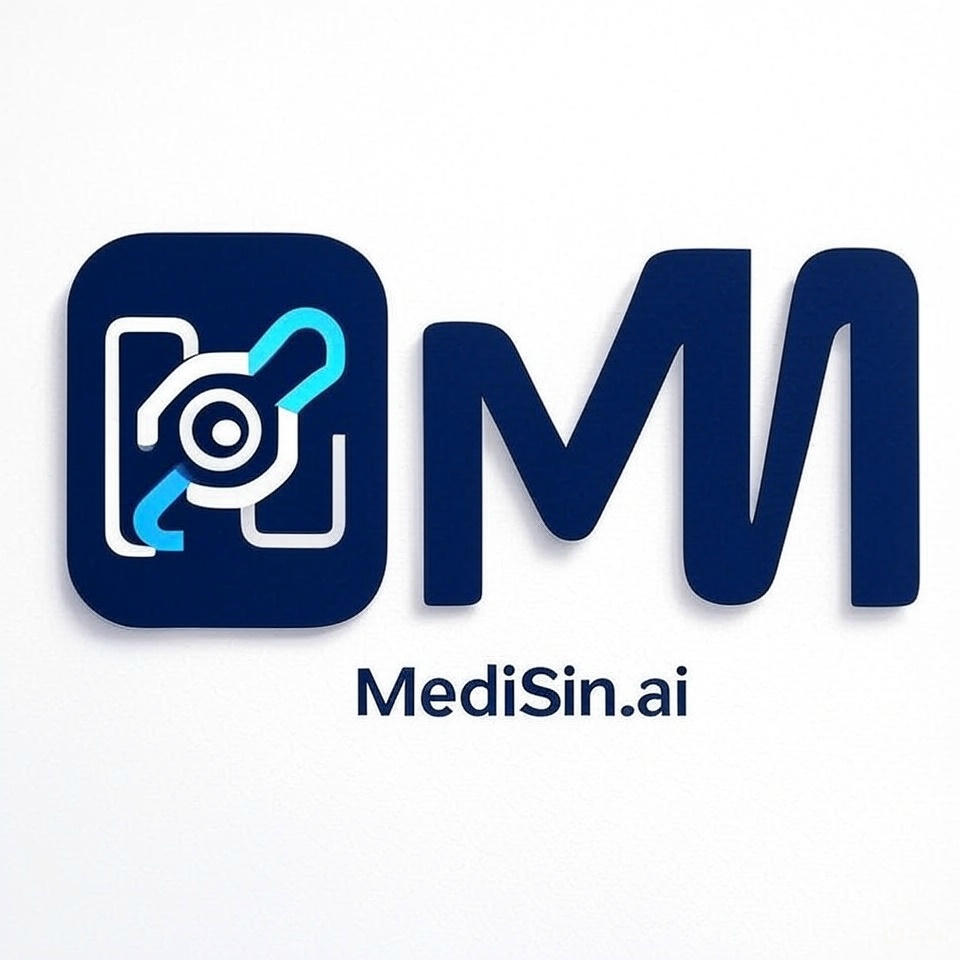

# MediSin.ai

 An AI Agent powered, Pharmacy platform built to streamline medication ordering and management;  detailed drug information and reminders for patients.

 

  <a href="#demo">Demo</a> •
  <a href="#features">Features</a> •
  <a href="#tech-stack">Tech Stack</a> •
  <a href="#testing">Well Tested</a> •
  <a href="#system-design">System Design</a> •
  <a href="#why-it-stands-out">Why it Stands Out</a> •
  <a href="#notes">Notes</a> •
  <a href="#pricing">Pricing</a> •
  <a href="#license">License</a> •
  <a href="#contribute">Contribute</a> •
  <a href="#revenue">Revenue Model</a> •
  <a href="#credit">Credit</a>

## 🚀 Demo

### 💊 Medication Workflow Walkthrough
**YouTube Video:** Patient and Shopkeeper demo
Link - https://www.youtube.com/watch?v=ZIC_A7jSB-E

### 🧑‍⚕️ Patient Adding Medicine
**Figure:** Real-time drug info fetch  with auto-fill  

### 🛒 Shopkeeper Stock Management
**Figure:** Inventory add with auto-fill  

### ✅ Continuous Integration (CI) with GitHub Actions
**Figure:** PHPUnit test on push with Codecov  

➡️ Config: `.github/workflows/laravel.yml`

---

## 🎯 Features for Users

- **👨‍⚕️ Patient Medicine Box**  
  Allows patients to add medications, confirm details from AI results, and save them securely.

- **🏪 Shopkeeper Stock Panel**  
  Shopkeepers manage inventory with quantity and API-based medicine verification.

- **🤖 AI Agent Integration**  
  A built-in AI agent intelligently fetches, analyzes, and auto-populates medicine information.

---

## 🧰 Tech Stack

| Area                | Technologies Used                                |
|---------------------|--------------------------------------------------|
| **Frontend**        | Blade, JavaScript, FilamentPHP                   |
| **Backend**         | Laravel (PHP), RESTful APIs                      |
| **Authentication**  | JWT with Redis Blocklist                         |
| **API Integration** | Gemini API                                       |
| **Queue System**    | Laravel Queue, Redis                             |
| **Database**        | MySQL                                            |
| **Caching**         | Redis                                            |
| **Testing**         | PHPUnit, GitHub CI, Codecov                      |
| **Monitoring**      | Laravel Telescope                                |
| **Deployment**      | Docker, Nginx, PHP-FPM                           |
| **CI/CD**           | GitHub Actions                                   |

---

## 🧪 Testing Strategy

### ✅ Unit Testing
- Covers:
  - `MedicineController`
  - `StockController`

### ✅ Integration Testing
- Tests:
  - Patient medicine addition flow
  - Shopkeeper stock addition flow
  - Auth routes (`/api/login`, `/api/me`, `/api/logout`)

### ✅ CI Integration
- Runs test suite and coverage checks on each PR via GitHub Actions and Codecov.

---

## 🧱 System Design

- **API-First**: RESTful endpoints for Patients and Shopkeepers
- **Microservice-Ready**: API service integration via service class layer
- **Security**: JWT with Redis token invalidation and hourly rotation
- **Scalability**: Horizontally scalable via Redis queue workers and container deployment

---

## ⭐ Why it Stands Out

- **AI Agent** auto-fills drug details reducing errors and manual entry
- **Role-based Panels**: Separate views and data flows for Patients vs. Shopkeepers
- **Test-Covered Code**: CI and coverage badges ensure safe contributions
- **Dual Licensing**: Open-source core with commercial options for enterprise scale
- A scalable, secure, and feature-rich

---

## 📝 Notes

- Laravel version: 11.x+
- PHP version: 8.2+
- FilamentPHP: Used for internal admin monitoring
- Redis Queue: Required for optimal performance in production

---

## 💸 Pricing (Freemium Model)

| Tier              | Features                                                                 | License         |
|-------------------|--------------------------------------------------------------------------|------------------|
| **Free Tier**     | Medicine Box, Stock Panel      | MIT License      |
| **Premium Tier**  | Reminders, Analytics, Pharmacy Integrations                             | Proprietary      |
| **Enterprise**    | Full source, Custom integrations, Commercial support                    | Commercial License |

---

## 📜 License

The MediSin.ai platform operates under a freemium model with dual licensing to balance open-source accessibility with business protection.

| Tier | Features | License | Terms |
|------|----------|---------|-------|
| **Free Tier** | - Medicine Box (Patients) - Stock Management (Shopkeepers) | MIT License | Open-source; source code is freely available for use, modification, and distribution under the MIT License. |
| **Premium Tier** | - Advanced analytics - Automated reminders - Pharmacy partnership integrations | Proprietary | Not open-source; these features are protected to support the business model and are accessible only through a paid subscription or commercial license. Contact the development team for pricing and terms. |
| **Commercial License** | Entire platform (Free + Premium features) | Commercial License | Available for businesses seeking to use the entire platform without MIT obligations, deploy proprietary versions, or require custom integrations. Contact the development team for pricing and terms. |

Community contributions to the Free tier are encouraged under MIT terms. See [CONTRIBUTING.md](CONTRIBUTING.md) for guidelines on contributing to the open-source core.

---

## 🤝 Contribute

1. Fork the repo
2. Create feature branch: `git checkout -b feature/xyz`
3. Commit: `git commit -m "Added xyz"`
4. Push: `git push origin feature/xyz`
5. PR to main

See `CONTRIBUTING.md` for rules.

---

## 💰 Revenue Model

The MediSin.ai platform leverages a freemium model to generate sustainable revenue while fostering an open-source community:

- **Premium Subscriptions**: Revenue is primarily driven by subscriptions to the Premium tier, which includes features like advanced analytics, automated reminders, and pharmacy partnership integrations. These cater to pharmacies and power users, with pricing tailored to scale with usage (contact the development team for details).
- **Commercial Licensing**: Enterprises requiring proprietary deployments or custom integrations (e.g., HIPAA compliance, dedicated clusters) can opt for a commercial license, providing flexibility without MIT obligations. This targets large-scale organizations and generates significant revenue through one-time or recurring fees.
- **Future Monetization**: Planned additions include premium add-ons (e.g., medication tracking, user profiles) and API access for developers, further diversifying income streams while maintaining the Free tier’s accessibility.

---

## 👨‍💻 Built & Maintained By

👔 Ready to join a team building high-impact systems
📨 Let’s connect for backend, DevOps, or system design roles

**Shaon Majumder**  
Senior Software Engineer  
Open source contributor | Laravel ecosystem expert | System design advocate  
🔗 [LinkedIn](https://linkedin.com/in/shaonmajumder) • [Portfolio](https://github.com/ShaonMajumder)